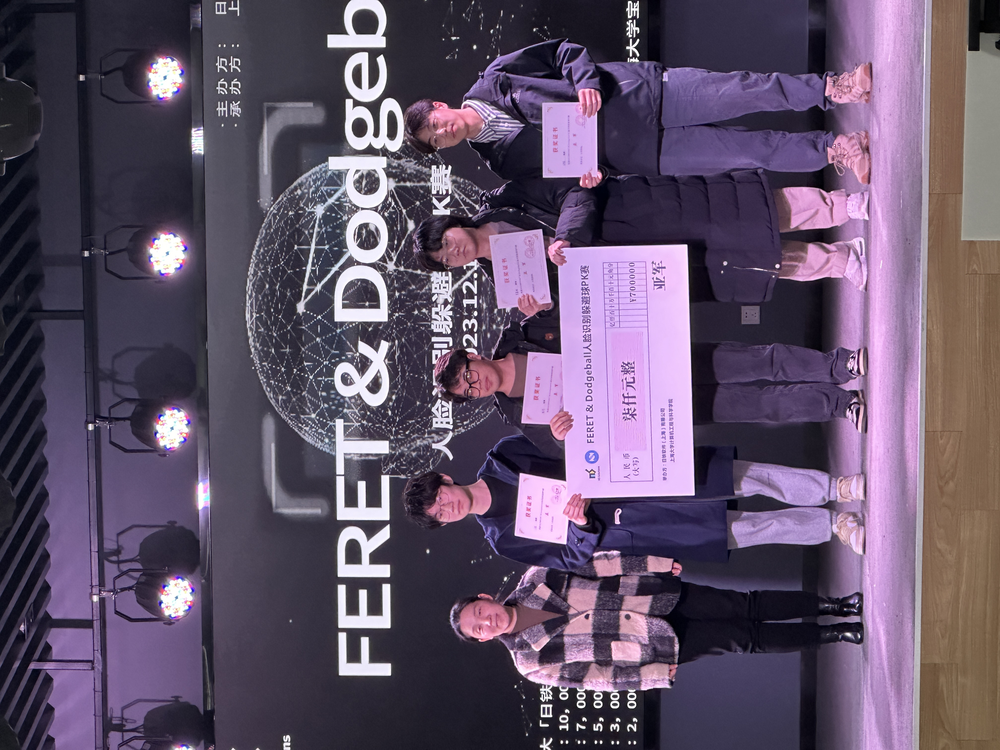

## News
【2024.12.15】We won ***Runner-Up*** in the *Nippon Software Cup* hosted by Shanghai University. Team members include [Tianyu HUANG](https://github.com/cookie-pie-oops), [Jun JIANG](https://github.com/Jungle0430) and [JianYu WU](https://github.com/Freddie1946) from SHU.



【2023.01.12】I achieved ***Outstanding Participation Award*** in the Winter School on Biometrics 2023. And thanks to [Yanhe BAI](https://github.com/byebaibai) from BNU for the contributions to this project during the WSB Hands On session.


# 第二届日铁杯人脸识别躲避球PK赛

## Dataset

The dataset, containing 536 real face images, can be downloaded by the [link](https://nextcloud01.nssol-sh.com/index.php/s/fCFMkx9w72wmeZ7).

Password: `20231215`

## Environment

Clone the repository first:

`git clone https://github.com/xuejifang/dodgeball.git`

Install the essential packages by:

`pip install -r requirements.txt`

## Per-trained Models

```shell
mkdir checkpoints
cd checkpoints
```

Download the pre-trained models by the [links](https://westlakeu-my.sharepoint.com/:f:/g/personal/fangxueji_westlake_edu_cn/Eo4icEalRGtIm2qPN_2BSvwBzeFwAw8fA-esv6EDmSE_iA?e=UhMUZA), and put them into the `checkpoints` folder.

## Config

```yaml
broker_ip: "iot.taginator.cn"   # MQTT broker IP
broker_port: 39683              # MQTT broker port
topic: "nssol/rtb/sensor1"      # MQTT topic, optional "nssol/rtb/sensor1"
```

## Face Recognize and Draw Picture

with file `./face_detect/face_recognize.py`

`RecognizeFace()`

    Input: image(numpy array of w*h*3)
    
    Return: face_postion, name, height_ratio, width_ratio
    
        · face_position is a list of detected position of face ([[face1_x, face1_y],[face2_x, face2_y]...])
        
        · name is a list of name of detected face, they are one-to-one correspondence
        
        · height_ratio and width_ratio is the radio between the original pictiure and the resized picture, used for adjusting the detected face bounding box


`DrawPicture()`

    Input: image(original), face_positions, names, body_points(the return of multi-object), height_ratio, width_ratio
    
    Return: a picture with name and action tag over the detected face


​      

## To Do

- [x] Subscribe MQTT
  - [ ] Optimize
- [x] Face Detection (YuNet)
- [ ] Face Recognition
- [x] Skeleton Points Detection
- [x] Pose Estimation
  - [ ] Optimize
- [ ] Draw Skeleton and Face Detection Boxes
- [ ] Implement in C++


# Assignment for WSB2022

For online participants, you can try with default backend and CPU target in case you do not have Khadas VIM3. In this case, you can install opencv-python using pip: `pip install opencv-python==4.5.4.58`.

If you want to try TIM-VX backend and NPU target, you will need to compile OpenCV (https://github.com/fengyuentau/opencv/tree/timvx_backend_support) from source with Python Interface following this guide (https://gist.github.com/zihaomu/f040be4901d92e423f227c10dfa37650).
# WSB2023-assignment

- **实现了一边人脸识别一边手势识别**
- **默认使用`face_detection_yunet_2021dec-quantized.onnx`和`face_recognition_sface_2021dec-quantized.onnx`作为人脸检测器，默认`database`在`./database/for_trian/`下，因此可以直接运行`main.py`**


**Demo 流程**：

1. 运行`main.py`
2. 发现检测到人脸为`Unknown`
3. 对着摄像头做出`OK`手势，进入到注册人脸系统
4. 在终端根据要求，输入您的名字
5. 键盘在英文模式下按下`s`键，保存人脸（可以多次保存）
6. 按下`Esc`键，退出注册系统
7. 此时人脸检测系统会重新检索数据库，生成特征
8. 最后可以进行人脸识别
9. 按下`Esc`键，退出人脸识别系统


**Disadvantages**：

- 从人脸识别系统进入到人脸注册系统，是跳转过去的，会先关掉人脸识别系统的摄像头，又重新打开注册系统的摄像头；后期有时间再优化，将其融合在一起
- 人脸注册系统参考CSDN https://blog.csdn.net/qq_47281915/article/details/121317889，作者是使用了`dlib`库下的`frontal_face_detector`作为人脸的特征提取器；后期有时间再优化，统一成OpenCV下的模型
- 没有实现**removing identities from database**功能
- 没有尝试其他**deep learning models**
- **总的来说，代码堆叠的跟sh*t一样，后期有时间再封装优化**


